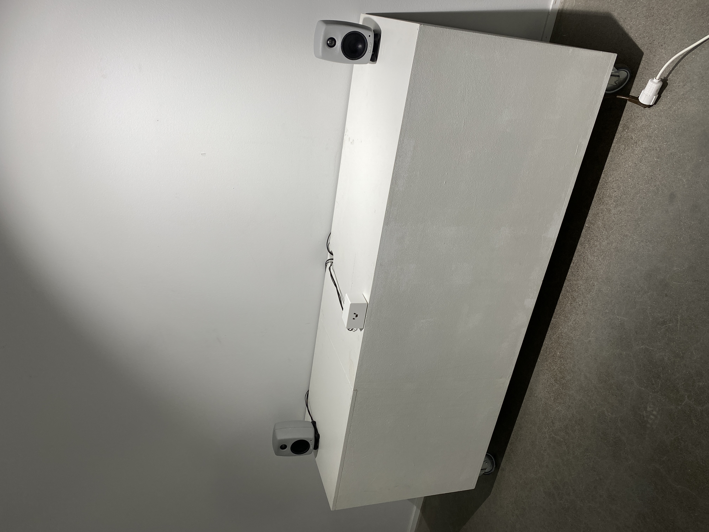
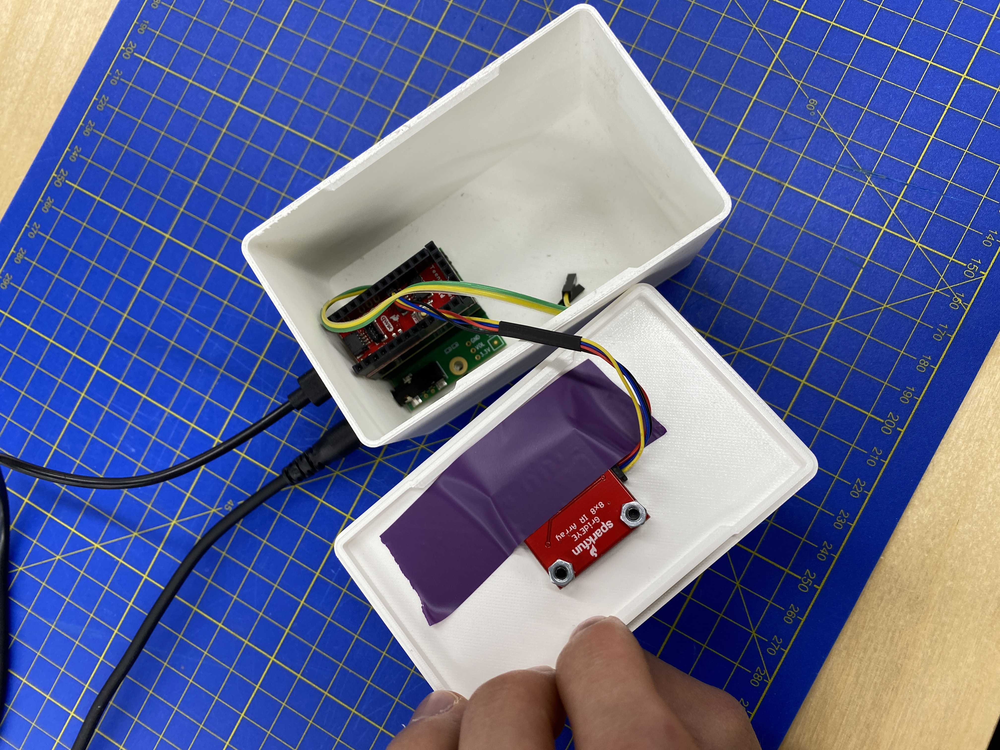
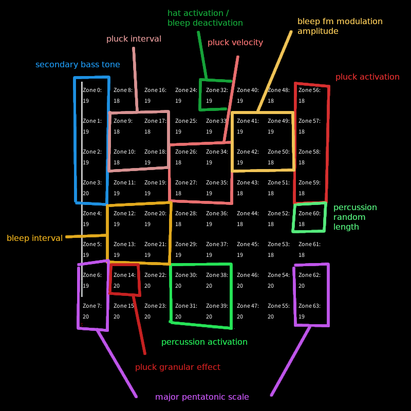

# Final Project Report

This page contains a short description and reflection of the final version of the course project. Additionally, I have written reports documenting my progress during the project weeks (5-7).

- [Initial Proposal](/phycomp-dir/docs/week-3)
- [Project Week 1](/phycomp-dir/docs/week-5)
- [Project Week 2](/phycomp-dir/docs/week-6)
- [Project Week 3](/phycomp-dir/docs/week-7)

## Who's playing?

A quasi-interactive generative music instrument that, using an infrared sensor, adapts its behavior to the presence and positioning of people in a space.

One of the goals of the installation was to make the viewers *passively* play an instrument by moving around, as playing an instrument is often regarded as active interaction.


[(YouTube link in case the embed is broken)](https://youtu.be/u2juiLE1fe8)

## Implementation

### Components

- Teensy 4.0 microcontroller
- Sparkfun Grideye AMG8833 infrared sensor
- 3d-printed enclosure to house the components in
- Speakers

### Technicalities

You can refer to the [Arduino sketch's GitHub repository](https://github.com/otsha/phycomp-final-project) if you would like to take a look at the implementation in code. If you are interested in using the AMG8833 sensor in your work, you can use the code on the [week 4 page](/phycomp-dir/docs/week-4) (with some modifications) to visualize the sensor output in Processing.

By my testing, the Grideye sensor reliably detects temperatures within a 2-meter distance. In addition to distance, clothing also affects the detection of surface temperatures. Finally, the sensor is very low-resolution, only 8 x 8 pixels in area. Despite its drawbacks, it can be used effectively to detect the *presence* of people; exactly what I needed for this project. I defined zones and individual pixels within the sensor's area that control various parameters of the different instruments.

## Reflection

Overall, I managed to keep the project's scope in check throughout the course. While I did drop the visualization aspect from the initial idea, it was an afterthought to begin with. I feel like it would not have added much value to the project while, at the same time, distracting viewers from the main event: the generative music.

On viewer interaction, I noticed that quite a few people were still drawn to playing the instrument by walking around and waving their hands in front of it. Even if it does not quite match with the idea I had for the project, it was fun to see people exploring the (admittedly quite limited) sounds of the instruments. I think a fun further development of the project could be to hide the sensor and controller from view completely to see if at least some viewers would still figure out that they can play it.

I might have gotten more pleasant (to me) sounds out of the project had I only used the Teensy to send midi signals to an external synthesizer rather than synthesizing everything with the Teensy. Then again, limiting myself to the Teensy's capabilities did also make for an enjoyable challenge and gave me an opportunity to actually use C in practice.

The sensor was not quite as good at detecting people as I had anticipated. Clothing and distance from the sensor both reduce surface temperatures, which means that there is not much nuance to the input; either people are detected or they are not. Another issue was the temperature difference between the basement workshop space and the 2nd floor gallery space, which meant that in some cases the instrument would activate even though no people were present.