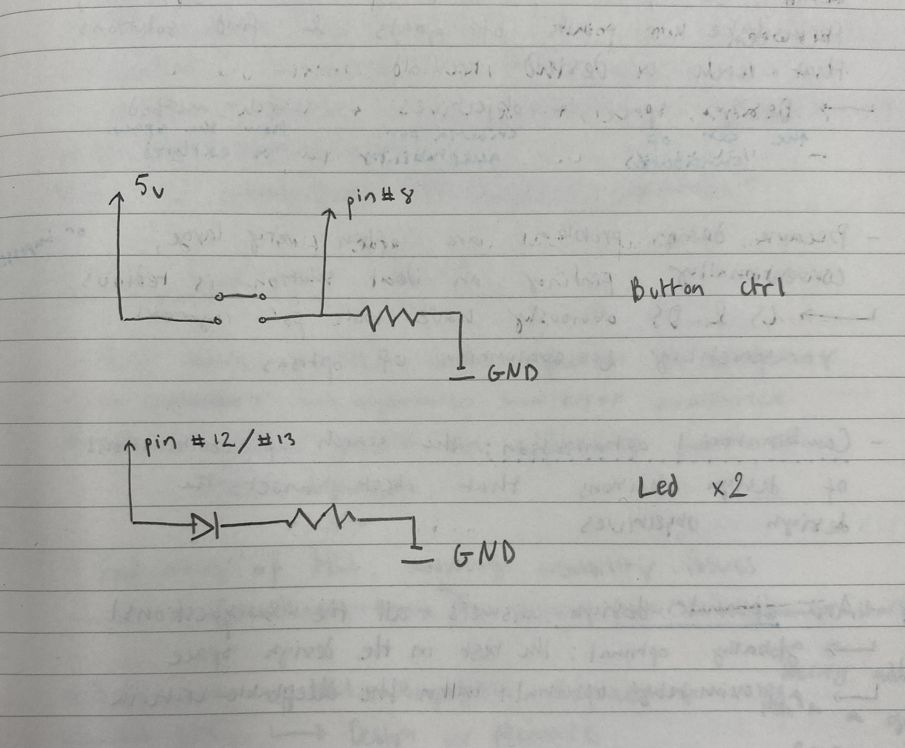

# Week 1 Deliverable

A circuit with two LEDs and a button switch, controlled by Arduino.

Pressing the button toggles the LEDs from both off, to one on and one off, to both on.


The jumper cables are color coded:
- Red = positive / 5V
- Blue = negative / ground
- Yellow = control (to / from Arduino pinouts)



```arduino

int counter, cd;

void setup() {
  pinMode(13, OUTPUT);
  pinMode(12, OUTPUT);
  pinMode(8, INPUT);

  counter = 0;
  cd = 0;
}

void loop() {
  if (counter == 0) {
      digitalWrite(13, LOW);
      digitalWrite(12, LOW);
  } else if (counter == 1) {
      digitalWrite(13, HIGH);
      digitalWrite(12, LOW);
  } else if (counter == 2) {
      digitalWrite(13, HIGH);
      digitalWrite(12, HIGH);
  }


  if (digitalRead(8) == HIGH && cd == 0) {
    counter += 1;
    cd = 100; // cooldown for 100 loop iterations
  }

  if (counter > 2) {
    counter = 0;
  }

  if (cd > 0) {
    cd -= 1;
  }
}

```