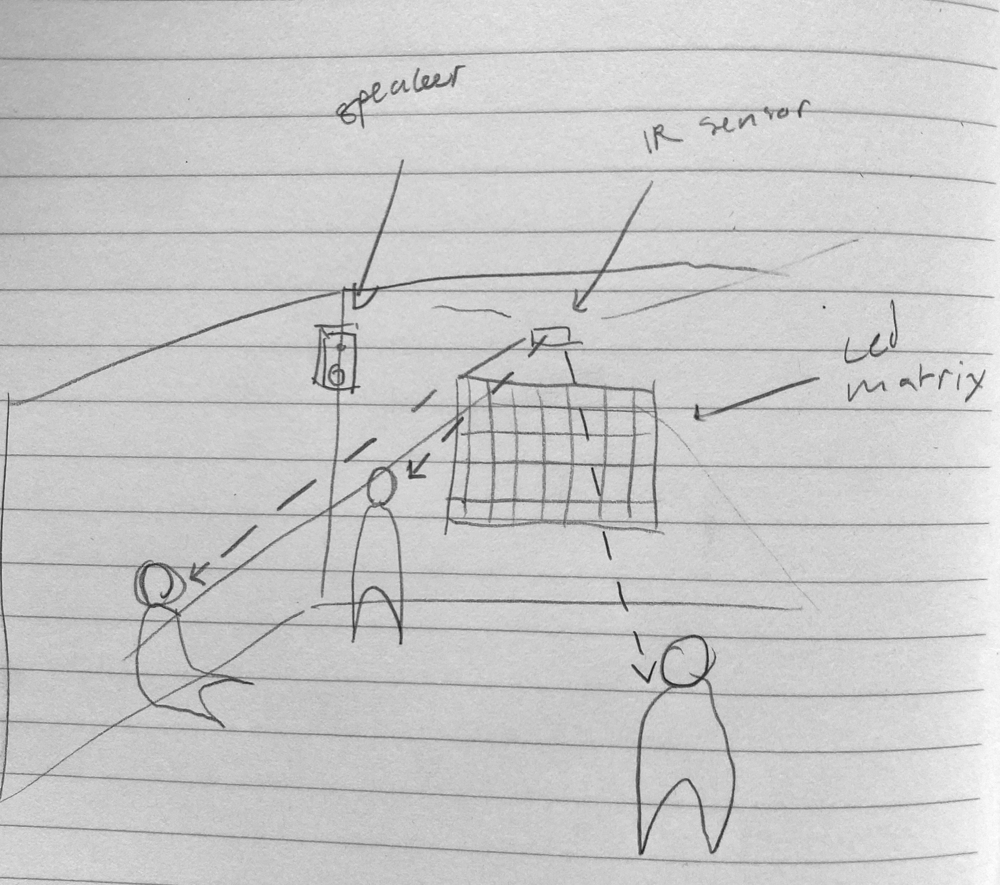

# Final Project Proposal

A generative music installation that adapts its sound based on the presence (and positioning) of people in a space.

[Audio proof of concept](https://on.soundcloud.com/TsH36)

The presence of people in the space is recognized using the IR matrix sensor. Pixels / sectors in the matrix represent certain parameters of the generative synth. When the presence of a person is detected in a pixel / sector, the parameter changes (somehow, still up in the air!).

I think having the presence of people be what controls the instrument is interesting because playing an instrument is often seen as something you *actively* do. I hope that it would invite viewers to stay in the space for longer and create a social atmosphere where people collaboratively explore the different sounds the instrument can produce.

If time permits, I would also like to explore visualizing the output of the instrument using an LED matrix.

## Concepts to Explore

- No / less screens
- Controlled randomness / generativity
- Novel ways to interact with music
- Meditative / hypnotic experiences

## Components

- Microcontroller to process input and output
  - IR module to detect the presence of people
- LED strips to create a "matrix" to visualize the sounds

Depending on how capable the Teensy is at generative music (I imagine not very), I may need a separate computer running VCVRack to take midi input from the Teensy and change a generative synth patch.
