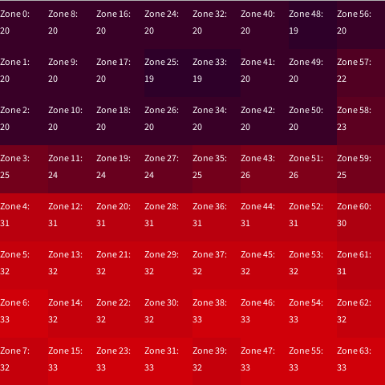

# Week 5 Project Progress Report

I had already figured out how to output *some* sound from the Teensy, so I began the week by working on outputting something more palatable.

I defined the [base frequencies of notes in the A440 equal-tempered scale](https://pages.mtu.edu/~suits/notefreqs.html) in an enum. Note that arduino (C) does not support floating point numbers in an enum, so these values are in kHz.

```arduino
enum Freq {
  C = 16350,
  CSharp = 17320,
  D = 18350,
  DSharp = 19450,
  E = 20600,
  F = 21830,
  FSharp = 23120,
  G = 24500,
  GSharp = 25960,
  A = 27500,
  ASharp = 29140,
  B = 30870
};
```

Because these are the base frequencies (C0-B0) and increasing a note by an octave means doubling its frequency, to get the frequency ***f*** of a note ***n*** in octave ***i*** would be defined as

```math
f(n_i) = f(n_0) * 2^i
```

As an example, using code, to get E4, we would call

```arduino
float e4 = (E / 1000.0) * pow(2, 4); // Division by 1000 to convert to Hz
```

I abstracted this functionality to a separate note class:

```arduino
class Note {
  public:
    Note(float freq);
    float oct(int octave);

  private:
    float _frequency;
};

Note::Note(float freq) {
  _frequency = freq;
};
  
float Note::oct(int octave) {
  return _frequency * pow(2, octave); 
};
```

I then experimented with adding another instrument and introducing limited randomness. To make the random notes slightly more melodic, I created helper method `getRandomNote` to randomly select a note from a pre-defined scale.

```arduino
int scale[] = {C, D, E, G, A};

float getRandomNote(int minOct, int maxOct) {
  int scaleIndex = round(random(0, 4));
  float noteFreq = scale[scaleIndex] / 1000.0;
  Note n(noteFreq);
  return n.oct(random(minOct, maxOct));
}
```

Something to consider refactoring here is defining `Note n` globally and only changing its value in the method rather than redefining it every single time the method is called.

Then, I brought in the IR sensor reading functionality that I implemented for the [week 4](/phycomp-dir/docs/week-4/) assignment.

For debug purposes, I expanded the processing code to print out the pixel indices. **Note** that while the sensor *readout* happens from left to right, top to bottom, the pixels are *rendered* from top to bottom, left to right. This is so that the rendered image is displayed with the correct rotation when the sensor is "the right way around" (text at the top).



Finally, I tried out changing the musical output based on the sensor input. I set a small percussive element to activate when the temperature within zones (indexes) 30, 31, 38 and 39 averages at higher than 23 degrees.
