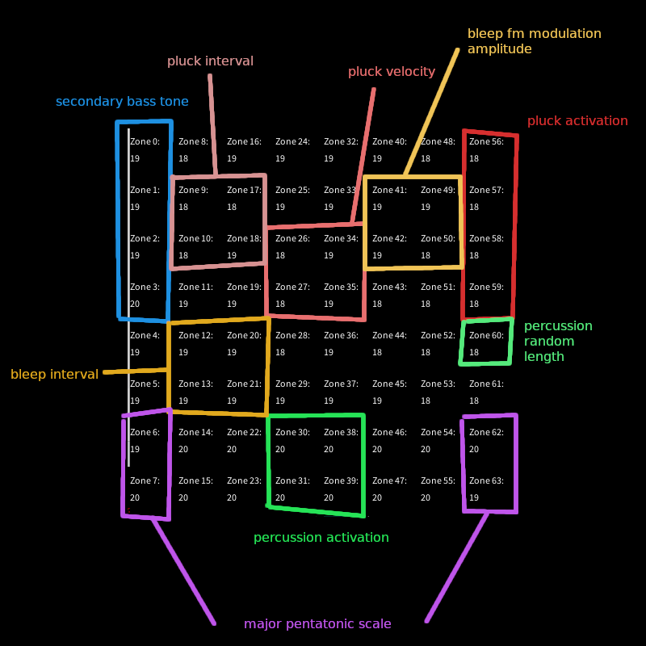

# Week 6 Project Progress Report

I started out the week by refactoring the `Note` class so that new instances are not created every time a new random note is generated. The getter and setter functions are slightly unnecessary for my generative use case, but they could come in handy if I wanted to expand the project later on.

```arduino
class Note {
  public:
    Note();
    float getRandomNoteFromScale(int scale[], int minOct, int maxOct);
    void setFrequency(float freq, int octave);
    float getFrequency();
 
  private:
    float _frequency;
};

Note::Note() {
  _frequency = 0;
};

float Note::getRandomNoteFromScale(int scale[], int minOct, int maxOct) {
  int scaleIndex = round(random(0, sizeof(scale)));
  float noteFreq = scale[scaleIndex] / 1000.0;
  int octave = random(minOct, maxOct);
  setFrequency(noteFreq, octave);
  return getFrequency();
}

void Note::setFrequency(float freq, int octave) {
  _frequency = freq * pow(2, octave);
}

float Note::getFrequency() {
  return _frequency;
}
```

Another larger update code-wise was to move the timing calculations to a separate `Clock` class instead of keeping track of several variables in the main code file. Anything that reduces clutter in the main `.ino` is welcomed, as the Teensy Audio Library sound generation functionality apparently cannot be abstracted to separate classes.

```arduino
class Clock {
  public:
    Clock();
    void setInterval(int index, float value);
    void setPrevious(int index);
    void update();
    bool counterOver(int index);

  private:
    float _cTime;
    float _pTimes[8];
    float _intervals[8];
};

Clock::Clock() {
  for (int i = 0; i < 8; i++) {
    _pTimes[i] = _cTime;
    _intervals[i] = 1000.0;
  }
};

void Clock::setInterval(int index, float value) {
  _intervals[index] = value;
};

void Clock::setPrevious(int index) {
  _pTimes[index] = _cTime;
}

void Clock::update() {
  _cTime = millis();
};

bool Clock::counterOver(int index) {
  if (_cTime - _pTimes[index] > _intervals[index]) {
    return true;
  }

  return false;
}
```

The rest of the week I mostly spent on improving (or "improving") the generated sounds. I set up control zones which control various parameters of the different instruments.

