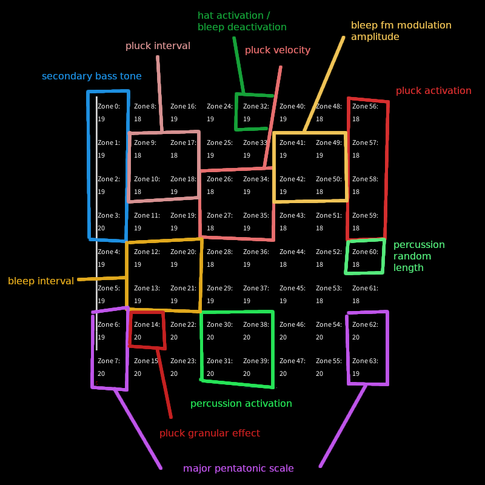
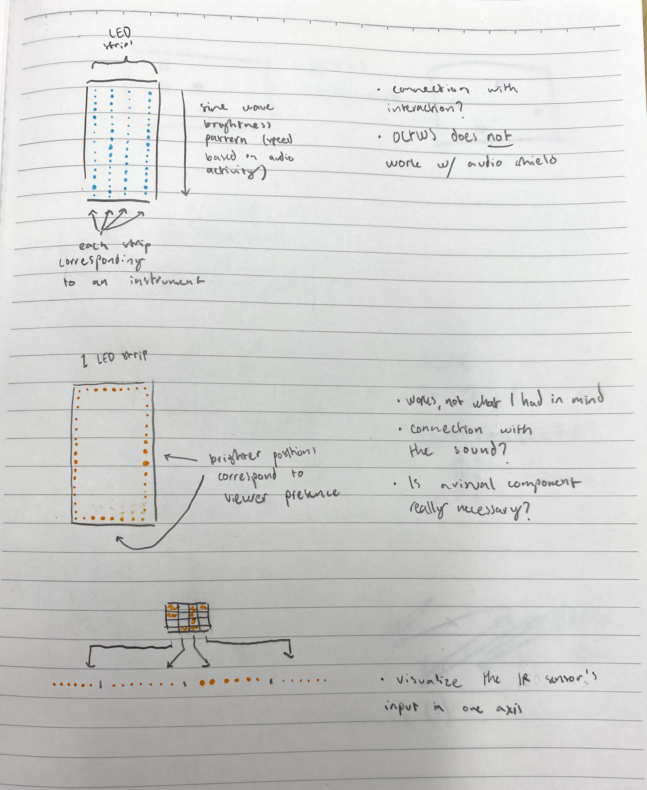
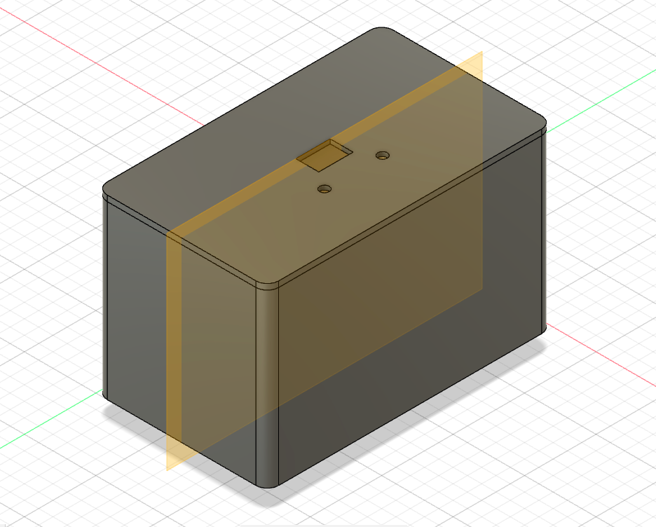
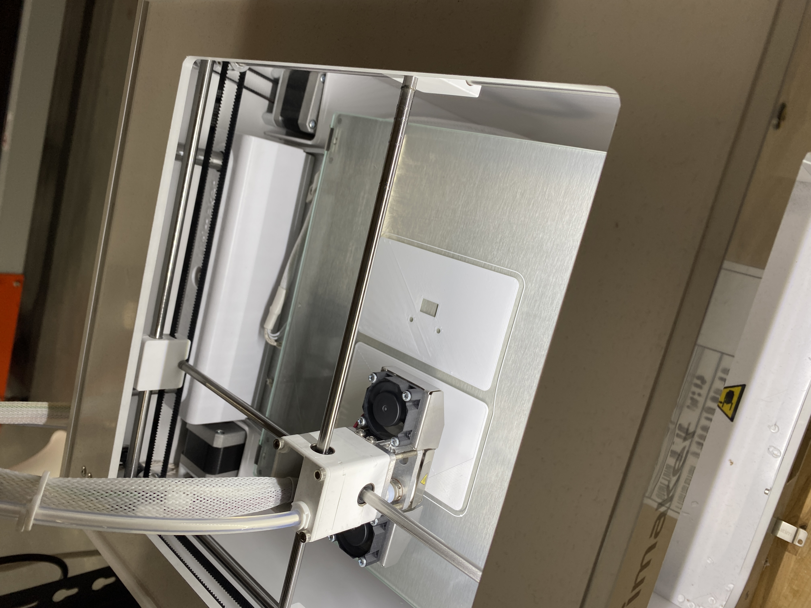
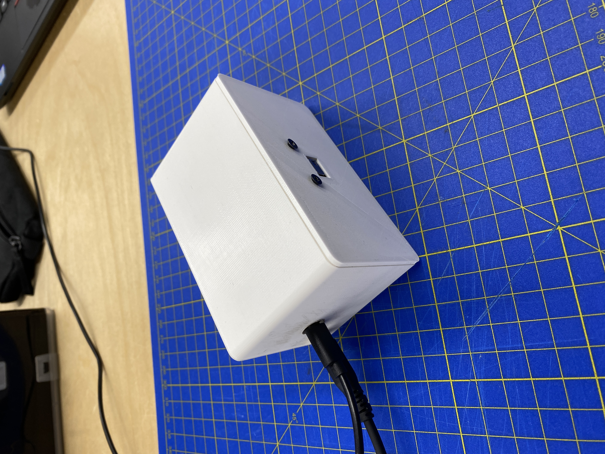
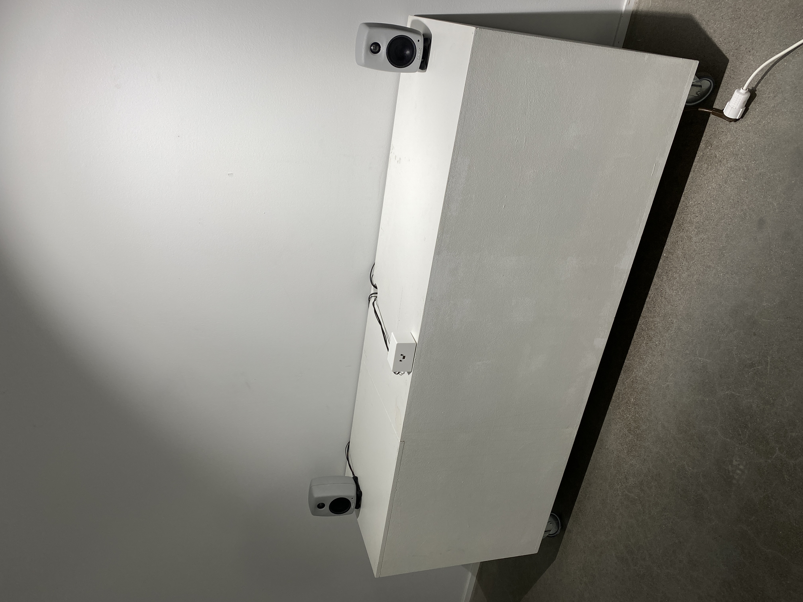

# Week 7 Project Progress Report

I started out the workshop week by adding a white noise "hat" as the fifth instrument to the project. I also added a granular effect to the "pluck" (Teensy audio library string) instrument to make the soundscape more interesting.

## Visualization Tangent

With the audio portion of the project at an acceptable state, I began working on the visualization aspect by plahying around with a GRB strip and seeing what kinds of visualizations I could come up with. 

After getting the LEDs to light up using a separate sketch, I attempted syncing them with the audio using the sound analyzing tools provided by the audio library. At this point, I ran into an issue where updating the lights would create a crackling sound in the audio output - I am guessing this is due to the Teensy's limited processing power.

Even though it was interesting to make the lights react to the audio, I felt that the visual feedback was not adding much value to the project. I did not want to add a visual element for the sake of adding a visual element, so I scrapped the idea altogether.

## Back on Track

Regardless, I knew that I would need an enclosure for the board and the sensor so that the electronics would not be exposed during the exhibit. I followed [Matti's guide](https://learn.newmedia.dog/courses/introduction-to-critical-making/01-monday/) to model a housing with a hole for the IR sensor.

Once the print was complete, I drilled a few extra holes to the enclosure for power, audio output and to attach the Teensy.

Before the exhibition, I went through the project's codebase and added descriptive comments where the code wasn't exactly self-documenting. I also wanted to do some last-minute tweaking of the music generation, but could not find anything that would be both fitting and not make the soundscape too chaotic.

On the final day of the project, I borrowed a pair of active speakers from takeout and set up the work in the Väre 2nd floor gallery space:

